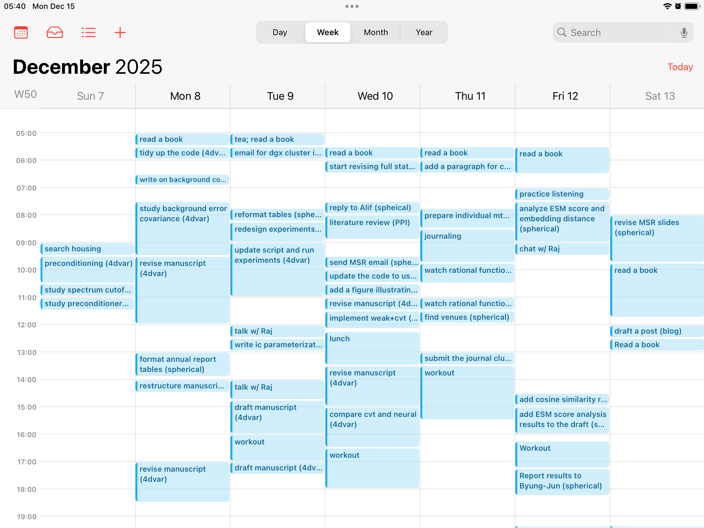

---
date:
  created: 2025-12-24

categories:
  - Productivity
---

# 캘린더 사용법 소개  

## introduction  
토요일 오전에 침대에 누워 인스타그램을 스크롤하다가 재미있어 보이는 reel을 발견했다. 머리가 길고 부유해 보이는 남자가 15분 단위로 뭘 했는지 전부 엑셀에 기록하는 습관을 들여보라는 내용이었다. 그 방법이 좋은 이유로 그는 기록을 되돌아보면서 어디서 시간 낭비가 발생하는지 알아낼 수 있고, 그 낭비되는 시간을 아끼면 더 많은 일을 할 수 있다고 했다. 고개가 절로 끄덕여지는 내용이었다. 나는 10–11월동안 그다지 생산적이지 못한 나날을 보내고 있었고, 뭔가 변화가 필요하다고 생각하던 참이었다. 시도해보지 않을 이유가 없었고, 기록하기 시작했더니 그 남자가 말한대로 어디서 시간이 줄줄 새는지 보이기 시작했다. 이 글은 내가 그 방법을 내 방식대로 적용해본 결과를 소개한다.  

<!-- more -->
  
## method  
나는 랩탑을 두 개 사용하고 있기에, Google spreadsheet를 하나 만들어서 15분 단위로 column을 만들고 기록을 시작했다. 시작하자마자 내가 부지런한 사람이 된 것 같은 기분이 들었다. 하지만 곧 불편하다는 생각이 들었다. 한 시간을 4개의 열로 쪼개야 하다 보니까 내가 하루동안 무엇을 했는지 한 눈에 잘 들어오지 않았고, 15분은 보통 한 작업에 집중하기에 너무 짧았다. 특히나, 조금 집중을 하다가 시계를 보면 30분이 넘게 지나있는 경우가 있는데 이럴 때 어떻게 해야 할지 난감했다. 또한 Google spreadsheet를 사용하는 것에 대해, 관리를 해야 할 파일이 하나 늘어난다는게 약간 불편하게 느껴졌다. 군대에서 “이렇게까지 해야 하나”라는 생각이 들 때는 보통 하는게 맞다란 걸 배웠지만, 그건 보통 일회성이 강한 일에 적용되는 말이다. 반복되는 일임에도 심리적 장벽이 크게 느껴진다면 습관을 들이기 어렵고, 아무리 좋은 방법이라도 결국에는 버려질 수 있다. 나는 적어도 이 방법을 한 달 동안은 유지해보고 싶었고, 따라서 지금 내가 사용하고 있는 시스템을 통해 이 방법을 습관화할 수 있을지 생각해보게 되었다.  
  
나는 아이폰을 사용하기 시작한 2016년부터 애플 캘린더를 사용해왔다. 중요한 회의나 일정을 애플 캘린더에 입력하고, 종종 들어가 확인해왔다. 일정 관리를 애플 캘린더로 하는데 익숙하기 때문에, 따로 엑셀 파일을 만들 필요 없고 애플 캘린더에 기록하면 되는게 아닐까? 생각이 들었고, 기록을 시작했다. 다만 대학교 랩탑에다가 내 icloud 계정을 넣고 싶지 않았고, 대학교 계정을 메인으로 쓰고 싶지도 않았다. 따라서 공적인 용도로 사용하는 구글 계정을 두 랩탑에 연결하고, 애플 캘린더와 구글 캘린더를 오가며 30분마다 한 일을 적어넣고 있다. 물론 때때로 집중을 하다보면 시계를 쳐다봤을 때 30분을 훌쩍 넘는 경우가 있다. 이럴 때는 굳이 여러 항목으로 분할하지 않고 입력하고 있다.  
  
  
## results  
  
  
캘린더에 자세하게 기록하면 자신이 시간을 어떻게 사용하고 있는지 한 눈에 볼 수 있다. 위 그림은 지난 일주일 동안 내가 무엇을 했는지 캘린더에 적어본 결과이다. 일단 빈 공간이 많아 보이는데, 변명부터 조금 하자면 몇 개의 공간은 사실 회의로 채워져 있다---아이패드에 대학교 캘린더가 연결되어 있지 않기 때문에 빈 공간으로 보이는 것이다. 하지만 이렇게 기록하기 전 까지는 어디서 시간이 새고 있는지 잘 몰랐었다. 특히 목요일 운동하는 시간을 보면 실제로 수행한 시간은 1시간 남짓이지만 왔다갔다 하는 시간을 모두 포함하면 2시간이 걸렸다. 덕분에 이번 주에는 운동할 때 시간을 효율적으로 사용하자고 목표를 세울 수 있었다.  
  
월: 17  
화: 12  
수: 15.5  
목: 6.5  
금: 10  
  
좋은 점이 한 가지 더 있었다. 끝낸 일을 어딘가에 기록함으로써 다음에 할 일이 무엇인지 생각해내기 더 쉬워진다. 그리고 캘린더의 빈 공간들을 채우고 싶어진다. 덕분에 멍하게 책상 앞에서 보내는 시간이 현저하게 줄었다. 이 숫자들은 각 요일마다 기록된 세션 횟수다. 한 세션당 30분씩이므로, 반으로 나누면 시간 단위가 된다. 볼 수 있듯이 하루 평균 8시간이 안 되고---목요일 같은 경우는 고작 3시간 15분 일하고 말았지만---놀랍게도 지난 주는 꽤 생산적인 한 주였다. 책상 앞에 오래 앉아 있는다고 해서 생산성이 좋아지는 것은 아니다. 생산성은 단위 시간동안 끝내는 할 일의 개수로 대략적으로 정의할 수 있다. 할 일이 무엇인지 모른 채로 책상에 앉아 있으면 분모가 늘어나니 생산성이 떨어지는 결과가 나온다. 따라서 생산성을 위해서는 할 일을 매우 구체적으로 정하고, 그걸 끝내는 것을 반복하면 된다. 다만, 할 일을 하나 끝내고 나면 다음에 할 일이 무엇인지 구체적으로 떠오르지 않는 경우가 있다. 이런 경우에 기록하는 습관을 들이는게 도움이 된다. 무엇을 했는지 기록하는 과정에서 생각을 정리할 수 있고, 자연스럽게 다음 step이 생각나기 때문이다.  
  
할 일을 정하는 것만큼 할 일을 끝내는 것도 중요하다. 효율적으로 할 일을 끝내는 방법으로 pomodoro 방법이 유명하다. 내가 30분마다 기록했던 것은 15분이 너무 짧은 시간이라 그랬기도 하지만, pomodoro 방법도 같이 연습해보고 싶어서였다.  
  
  
## conclusion  
이 글에서는 생산성을 높이기 위한 캘린더 작성법을 소개했다. 핵심은 **지난 30분동안 무엇을 했는지 적는 습관을 들이는 것**이다. 무엇을 했는지 기록하는 행위를 통해 생각을 정리하고, 자연스럽게 다음 단계로 나아갈 준비를 할 수 있다. 시간 간격을 30분으로 설정함으로써 pomodoro 방법과 동시에 진행할 수 있다. 쌓인 기록을 보면서 어디에서 시간 낭비가 발생하고 있는지 알아챌 수 있다.  
  
과연 이 방법이 실제로 효과가 있는지는 좀 더 지켜봐야 할 것 같다. 하지만 더 나은 생산성을 위해서는 이런 시도를 미루지 않고 해봤다는 것, 그런 삶의 태도를 유지해나가는 것이 장기적으로 가장 중요한 게 아닐까란 생각이 든다.  
  
