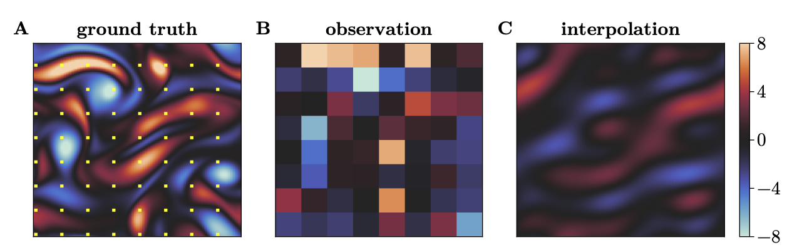
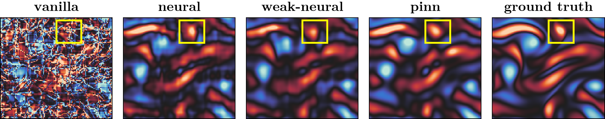

---
date:
  created: 2026-04-30

categories:
  - SciML
---

# 인공신경망의 Spectral Bias를 유용하게 사용한 논문 소개

Implicit neural representation이란 키워드를 2023년 봄에 친구로부터 처음 전해들었다. 이미지 하나를 인공신경망 하나로 표현한다는 설명이었는데, neural radiance field와 같은 응용보다는 인공신경망을 통해 이미지를 표현할 시, 이미지의 세밀한 부분들이 잘 재건이 되지 않는 spectral bias라는 현상에 이끌렸다 -- 수강했던 머신 러닝 과목에서 해당 내용에 대해서 발표도 했었고, 방학 동안 physics-informed neural network와 연관지어 [작은 탐구](https://github.com/jaeminoh/Siren_PINNs)도 해 봤었다. 이 포스트에서는 spectral bias를 단순 한계로 여기는 것을 넘어, 유용하게 사용한 논문 한 편을 소개한다.

<!-- more -->

기상 관측소에서 관측된 값을 통해 관측소가 없는 지점의 강수량을 계산하는 문제를 생각해보자. 가장 단순하고 빠른 방법은 다항식을 이용한 보간법이겠지만, 실제로는 강수량을 공간에 대한 함수로 보고, 대기의 상태를 기술하는 방정식과 관측된 값을 잘 결합해서 (보간법보다 더 정확한) 강수량을 나타내는 함수를 추정한다.

이 과정을 단순화해서 살펴보도록 하자. 위 이미지의 A는 강수량을 나타내는 함수, 그리고 노란 점들은 관측소의 위치라고 생각할 수 있다. B는 관측소에서 관측된 강수량을 표현한다. C는 보간법으로 추정된 강수량 함수이다. A와 C를 비교하면 보간법에 의해 얻은 강수량 함수는 상당히 부정확함을 볼 수 있다. 더 정확한 추정치를 얻기 위해, 보통 다음과 같은 최적화 문제를 고려한다.

$$
  \arg \min_{u_0} \sum_{k=0}^{K} \|y_k - H(\hat u_k)\|^2, \qquad \text{subject to } y_k = H(u_k) \text{ and } \hat u_k = F^{(k)} (u_0).
$$

여기서 중요한 것은, $u_0$에 대해서 어떤 목적 함수를 줄이는 방향으로 최적화를 진행한다는 점이다. 이 최적화 문제는 목적 함수를 계산하는 비용이 비싸기 때문에 해를 얻기 쉽지 않다. 게다가 해가 유일하다고 보장되어 있지 않아서 목적 함수를 어찌어찌 잘 줄였다고 해도 이상한 해를 얻을 수도 있다. 아래 그림의 "vanilla"가 이 경우를 나타낸다. $u_0$의 초기값을 위 그림의 C로 설정한 후 최적화를 진행했더니, 실제 함수와 전혀 다른, 아주 이상한 함수를 얻었다.

그렇다면 "neural," "weak-neural," "pinn"은 어떻게 했길래 실제 함수와 비슷한 함수를 얻을 수 있었을까? $u_0$를 $u_0^\theta$로 나타내고, 인공신경망의 파라미터에 대해 최적화를 진행했더니 위와 같은 결과를 얻을 수 있었다. 너무 간단한 방법이지만 효과가 확실해서 놀라웠다. "vanilla"에서 보이는 이상한 아티팩트들이 전혀 보이지 않았다. 즉, 이미지의 세밀한 디테일을 재건하지 못한다는 인공신경망의 spectral bias가 이 상황에서는 이상한 아티팩트들이 생기지 않도록 억제하고 있는 것이다.

이 결과에 대해 조금 더 자세하게 탐구한 논문은 [여기](https://arxiv.org/abs/2509.21751), 실험을 진행하는데 사용한 코드는 [여기](https://github.com/jaeminoh/neural-4dvar)에서 찾을 수 있다.